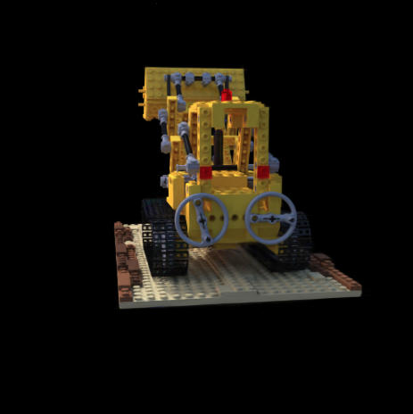

# 3D Gaussian Splatting — Minimal Differentiable Reference Implementation

A compact, end-to-end PyTorch reference implementation of differentiable 3D Gaussian splatting, together with project deliverables including final report, proposal, and presentation slides.

## Overview

This project implements a minimal Gaussian-splatting renderer that:
- Parameterizes a scene as **N anisotropic 3D Gaussians** (centers, rotations, scales, colors, opacity)
- Projects Gaussians to the image plane using **exact Jacobian of perspective projection**
- Computes **2×2 screen-space covariance** via covariance pushforward: Σ_img = J Σ_cam Jᵀ
- Rasterizes using a **naive, fully-differentiable software renderer** (front-to-back alpha compositing)
- Trains via PyTorch backprop to fit a target image

The code is intentionally small and readable—ideal for learning, experimenting, and extending into a research baseline.

## Key Features

✓ **3D Anisotropic Gaussians**: Parameterized by center (μ), rotation (axis-angle), and log-scales  
✓ **Differentiable Projection**: Perspective camera model with covariance pushforward  
✓ **Numerically Stable**: Handles 2×2 covariances with Cholesky + jitter fallback, pseudo-inverse fallback  
✓ **Fully Differentiable**: Rasterizer and training loop work end-to-end in PyTorch  
✓ **Minimal & Readable**: Single-file implementation (~360 lines) with inline documentation  

## Files

| File | Purpose |
|------|---------|
| `sample.py` | Complete implementation + toy training script (~360 lines) |
| `sample_explained.txt` | Detailed line-by-line explanation and next steps |
| `Final_Report_CSE575.pdf` | Project final report (methodology, experiments, results) |
| `Gaussian Splatting Pres - G4.pptx` | Presentation slides |
| `Project Proposal.pdf` | Original project proposal |
| `video demo.mp4` | Visual demo of rendered outputs |

## Quick Start

### Requirements
```bash
python 3.10+
torch
imageio
numpy
```

### Run the toy experiment

```bash
python sample.py
```

This will:
1. Create a synthetic target image (blue circle + red square)
2. Initialize 256 Gaussians randomly in front of the camera
3. Optimize for 200 iterations using Adam (lr=5e-2)
4. Save debug outputs: `debug_pred_*.png`, `prediction.png`, `target.png`

### Training loop (from sample.py)

```python
def train_tinygs():
    torch.manual_seed(42)
    H, W = 96, 96
    cam = default_camera(H, W)
    target = make_toy_target(H, W, device())
    
    model = TinyGS(n_gauss=256).to(device())
    opt = torch.optim.Adam(model.parameters(), lr=5e-2)
    
    for it in range(200):
        opt.zero_grad(set_to_none=True)
        pred = model(cam, H, W)
        loss = F.mse_loss(pred, target) + 1e-4 * regularization_terms()
        loss.backward()
        torch.nn.utils.clip_grad_norm_(model.parameters(), 1.0)
        opt.step()
        
        if (it + 1) % 50 == 0:
            psnr = -10.0 * torch.log10(loss).item()
            print(f"iter {it+1:04d}  loss={loss:.5f}  psnr={psnr:.2f}dB")
```

## Implementation Details

### Core Components

1. **GaussianCloud**: Stores N Gaussians with learnable parameters:
   - `mu`: (N, 3) centers in world space
   - `rotvec`: (N, 3) axis-angle rotations
   - `log_scale`: (N, 3) log-scales (ensures positivity)
   - `rgb`: (N, 3) per-Gaussian colors
   - `logit_opacity`: (N, 1) per-Gaussian opacity (sigmoid → [0,1])

2. **Projection Pipeline**:
   - Transform world means to camera: `μ_c = (W2C · [μ_w; 1])[:3]`
   - Compute Jacobian J of perspective projection (2×3 per Gaussian)
   - Pushforward covariance: `Σ_uv = J · Σ_c · Jᵀ`

3. **Rasterizer**:
   - Depth sort (front-to-back)
   - Per-Gaussian 2D Gaussian evaluation on pixel grid
   - Alpha compositing: `out += (α·T)·color`, `T *= (1−α)`
   - Complexity: O(N·H·W)

### Numerical Stability

The 2×2 covariance matrices are stabilized by:
- **Symmetrization**: `Σ = 0.5(Σ + Σᵀ)`
- **Pixel-space floor**: Add `(0.5 px)² I` to prevent collapse
- **Cholesky with jitter**: Try Cholesky; if it fails, add increasing jitter and retry
- **Fallback to pseudo-inverse**: If Cholesky still fails, use `pinv` for that entry

## Suggested Extensions

From the report and code comments, natural next steps include:

- **Multi-view supervision**: Load COLMAP cameras + real images; accumulate losses across views
- **Appearance models**: Replace per-Gaussian RGB with low-order **spherical harmonics** (SH), condition on view direction
- **Rasterization speedups**: 
  - Tile-based splatting (bin Gaussians by 3σ footprint)
  - Bounding-box culling and depth-aware pre-culling
  - Mixed precision (AMP)
- **Optimization & densification**:
  - **Split/merge**: When Gaussians grow large or cover high residual, split into two; merge tiny overlapping ones
  - Per-parameter-group learning rates (e.g., higher for color/opacity, lower for pose/scales)
  - Cosine decay + warmup schedules
- **Evaluation**: PSNR/SSIM/LPIPS per view, histograms of scale/opacity, splat footprint visualization

## Project Documentation

### Final Report (`Final_Report_CSE575.pdf`)
Contains:
- Project motivation and related work
- Detailed implementation (Gaussians, projection, rasterization)
- Experiments and qualitative results
- Quantitative metrics and ablations
- Discussion and future work

### Presentation (`Gaussian Splatting Pres - G4.pptx`)
Slides summarizing:
- High-level approach
- Key algorithmic contributions
- Results and demo

### Proposal (`Project Proposal.pdf`)
Original project scope and objectives

## Architecture & Algorithm

```
Input: Target image
  ↓
Initialize N Gaussians (centers, rotations, scales, color, opacity)
  ↓
Forward pass:
  • Transform world → camera space
  • Compute 2D covariances via Jacobian pushforward
  • Evaluate 2D Gaussians on pixels (rasterize)
  • Alpha composite front-to-back
  ↓ Render: RGB image
  ↓
Compute loss (MSE to target + regularization)
  ↓
Backprop through all operations
  ↓
Update parameters (Adam optimizer)
  ↓
Repeat → Fit Gaussians to target
```

## Performance Notes

- **Rasterizer complexity**: O(N·H·W) — fine for prototyping, not real-time for large scenes
- **Typical toy experiment**: 256 Gaussians, 96×96 images, ~200 iterations ≈ seconds on GPU
- **Main bottleneck**: Per-pixel-per-Gaussian evaluation; mitigated by tile-based splatting in production systems

## Evaluation: NeRF Synthetic "Lego" — Results & Metrics

Below is an example reconstructed scene (front 3/4 view) from the report. The image file is included in `assets/`.



*Example reconstructed Lego scene — front 3/4 view of the excavator model.*

The repository's Final_Report_CSE575.pdf and slides describe a set of experiments on the NeRF Synthetic Lego scene comparing three 3DGS training configurations: Baseline, Compact, and Regularized.

### Experimental overview
- Dataset: NeRF Synthetic — Lego scene (exact image count/resolution not reported in the available report)
- All configurations were trained for **30,000 iterations**
- Evaluated metrics: **PSNR (dB)**, **SSIM**, **LPIPS**

### Training profiles / hyperparameters

| Parameter | Compact | Regularized | Baseline |
|---|---:|---:|---:|
| SH Degree | 2 | 3 | 3 |
| Growth Stop | 7,000 | 15,000 | 25,000 |
| Growth Threshold | 0.0006 | 0.0002 | 0.0002 |
| Refinement Frequency | 300 | 100 | 200 |
| Opacity Loss | 0.005 | 0.0001 | 0.0 |
| SSIM Weight | 0.2 | 0.4 | 0.2 |

### Final quantitative results (at 30k iterations)

| Metric | Compact | Baseline | Regularized | Best |
|---|---:|---:|---:|---|
| PSNR (dB) | 22.50 | 26.42 | **26.69** | Regularized |
| SSIM | 0.807 | 0.916 | **0.924** | Regularized |
| LPIPS | 0.212 | 0.100 | **0.093** | Regularized |

The Regularized configuration achieved the best overall reconstruction quality (highest PSNR/SSIM and lowest LPIPS).

### Storage efficiency

| Profile | Final File Size | Reduction vs. Baseline |
|---|---:|---:|
| Baseline | 11,994 KB (~12.0 MB) | — |
| Regularized | 8,922 KB (~8.9 MB) | **25.6% smaller** |
| Compact | 329 KB (~0.3 MB) | **97.2% smaller** |

The Compact profile trades visual fidelity for massive storage reduction; Regularized reduces size while improving visual quality relative to Baseline.

### Key findings (excerpt)
1. Regularization improved quality and reduced size — Regularized achieved best PSNR/SSIM/LPIPS and reduced file size by ~25.6% vs. Baseline.
2. Compact configuration dramatically reduced storage (≈97.2% smaller) at the cost of lower reconstruction quality.
3. Opacity loss reduced floating semi-transparent artifacts (floaters) and produced cleaner geometry under the Regularized setting.
4. Growth-stop hyperparameter strongly affects convergence: Compact plateaued after the 7k growth stop; Regularized showed steady improvements surpassing Baseline by ≈12k iterations.
5. 3DGS is highly tunable: small changes to growth/pruning/opacity/SSIM weighting change the balance between quality and size.

### Qualitative observations
- Baseline and Regularized show similar global reconstruction; Regularized exhibits cleaner geometry and fewer floaters.
- Compact preserves coarse structure but loses high-frequency texture and specular details.

### Limitations reported in the study
- The report did not list the number of Gaussian primitives or exact convergence times.
- Dataset image count and resolution were not specified in the available report extract.
- Rendering FPS and comparisons versus NeRF implementations were not provided.

### Future work suggested
- Compare Regularized / Compact 3DGS with NeRF baselines
- Track Gaussian counts during training and measure FPS across configurations
- Apply the same experiments to additional NeRF Synthetic scenes and real-world captures

> Note: the numeric tables above were added to this README from the project's Final_Report_CSE575.pdf and the author-provided text. If you want the figures (plots or example renders) embedded in this README, I can add thumbnails linked to the report images or include the relevant rendered PNGs from the repository.

## References

- **Kerbl et al. (2023)**: "3D Gaussian Splatting for Real-Time Radiance Field Rendering"  
  This repo follows the spirit of their work but with simplifications for clarity and differentiability.

## License

MIT License (see header in `sample.py`)

## Contact

Repository Owner: [satyym-stack](https://github.com/satyym-stack)

---

**For detailed explanations of every function and suggested optimizations, see `sample_explained.txt`.**
